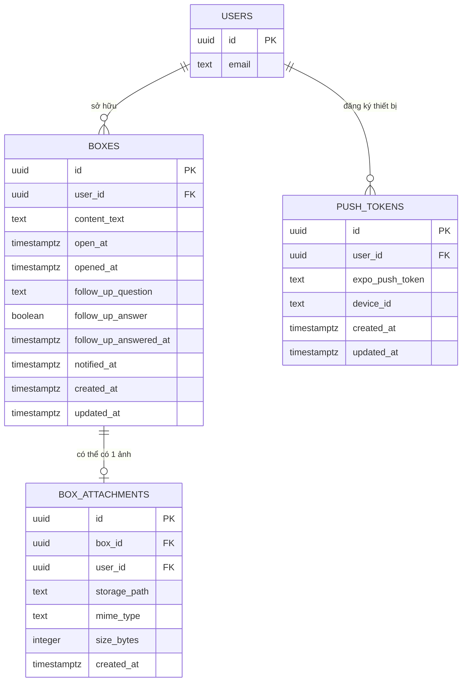

# Database Schema - FutureBoxes (Supabase / Postgres)

## 1. ERD



**Ghi chú thiết kế**:
- `USERS` = `auth.users` do Supabase Auth quản lý, không tạo bảng riêng (không cần field ngoài email/id cho MVP).
- **Tách `box_attachments` thay vì lưu `image_url` trực tiếp trong `boxes`**: đáp ứng NFR "Scalability — hỗ trợ thêm loại nội dung mới (audio, video) sau này mà không đổi cấu trúc bảng chính". MVP giới hạn 1 ảnh/hộp được enforce ở tầng ứng dụng (upload xong mới cho tạo hộp), không cần CHECK/trigger DB cho giới hạn này.
- **Không tách bảng riêng cho follow-up question/answer**: PRD giới hạn cứng 1 câu hỏi Yes/No/hộp, gộp thẳng vào `boxes` là đủ, tách bảng sẽ over-engineer.
- **`status` của hộp không lưu cột riêng, mà derive** từ `opened_at` và so sánh `open_at` với `now()` (xem view bên dưới) — tránh lệch dữ liệu giữa cột status và các mốc thời gian thực tế.
- `box_attachments.user_id` denormalize từ `boxes.user_id` để RLS policy đơn giản (không cần subquery join sang `boxes` mỗi lần check).

## 2. Table Schemas

### 2.1 `boxes`

| Field | Type | Constraint | Default |
|---|---|---|---|
| id | uuid | PK | `gen_random_uuid()` |
| user_id | uuid | NOT NULL, FK → `auth.users(id)` ON DELETE CASCADE | - |
| content_text | text | NOT NULL, CHECK (`char_length(content_text) <= 2000`) | - |
| open_at | timestamptz | NOT NULL, CHECK (`open_at > created_at`) | - |
| opened_at | timestamptz | NULL (NULL = chưa mở) | NULL |
| follow_up_question | text | NULL, CHECK (`char_length(follow_up_question) <= 200`) | NULL |
| follow_up_answer | boolean | NULL (chỉ set khi opened_at đã có, không sửa lại được) | NULL |
| follow_up_answered_at | timestamptz | NULL | NULL |
| notified_at | timestamptz | NULL (cron dùng để tránh gửi push trùng) | NULL |
| created_at | timestamptz | NOT NULL | `now()` |
| updated_at | timestamptz | NOT NULL | `now()` (trigger cập nhật) |

Ràng buộc nghiệp vụ bổ sung (enforce qua CHECK/trigger, không chỉ app-level vì đây là điều kiện bảo mật/chống gian lận):
- CHECK: nếu `follow_up_answer IS NOT NULL` thì `follow_up_question IS NOT NULL` (không trả lời câu hỏi không tồn tại).
- Trigger `BEFORE UPDATE`: chặn sửa `content_text`, `open_at`, `follow_up_question` sau khi `opened_at IS NOT NULL` hoặc sau khi đã qua `open_at` (đúng AC #2 và #7 — chỉ sửa/xóa khi còn "Đang khóa").
- Việc set `opened_at` chỉ được thực hiện qua RPC/Edge Function dùng `now()` phía server (không nhận `opened_at` từ client) — chống gian lận đổi giờ máy.

### 2.2 `box_attachments`

| Field | Type | Constraint | Default |
|---|---|---|---|
| id | uuid | PK | `gen_random_uuid()` |
| box_id | uuid | NOT NULL, UNIQUE, FK → `boxes(id)` ON DELETE CASCADE | - |
| user_id | uuid | NOT NULL, FK → `auth.users(id)` ON DELETE CASCADE | - |
| storage_path | text | NOT NULL (path trong Supabase Storage bucket `box-photos`) | - |
| mime_type | text | NOT NULL, CHECK (`mime_type IN ('image/jpeg','image/png')`) | - |
| size_bytes | integer | NOT NULL, CHECK (`size_bytes <= 5242880`) | - |
| created_at | timestamptz | NOT NULL | `now()` |

`UNIQUE(box_id)` = enforce "tối đa 1 ảnh/hộp" ở DB (nâng cấp lên nhiều ảnh sau này chỉ cần bỏ UNIQUE này).

### 2.3 `push_tokens`

| Field | Type | Constraint | Default |
|---|---|---|---|
| id | uuid | PK | `gen_random_uuid()` |
| user_id | uuid | NOT NULL, FK → `auth.users(id)` ON DELETE CASCADE | - |
| expo_push_token | text | NOT NULL | - |
| device_id | text | NOT NULL | - |
| created_at | timestamptz | NOT NULL | `now()` |
| updated_at | timestamptz | NOT NULL | `now()` |

`UNIQUE(user_id, device_id)` — mỗi thiết bị/user chỉ giữ 1 token mới nhất (upsert khi token refresh).

### 2.4 View `boxes_with_status` (derive status, phục vụ tính năng #3 - Danh sách hộp)

```sql
CREATE VIEW boxes_with_status AS
SELECT b.*,
  CASE
    WHEN b.opened_at IS NOT NULL THEN 'opened'
    WHEN now() >= b.open_at THEN 'ready'
    ELSE 'locked'
  END AS status
FROM boxes b;
```

## 3. Indexing Strategy

| Index | Mục đích |
|---|---|
| `idx_boxes_user_id` on `boxes(user_id)` | Query danh sách hộp theo user (tính năng #3) |
| `idx_boxes_open_at_pending` PARTIAL: `boxes(open_at) WHERE opened_at IS NULL AND notified_at IS NULL` | Cron quét hộp đến hạn để gửi push (tính năng #6), chỉ scan hộp chưa mở & chưa notify — nhỏ và nhanh hơn nhiều so với full scan |
| `idx_box_attachments_box_id` on `box_attachments(box_id)` | Đã có UNIQUE constraint tự tạo index, join nhanh khi mở hộp |
| `idx_push_tokens_user_id` on `push_tokens(user_id)` | Cron lấy token khi gửi push cho 1 user |

## 4. Row Level Security (RLS)

Bật RLS trên cả 3 bảng (`boxes`, `box_attachments`, `push_tokens`). Policy chính (áp dụng cho SELECT/INSERT/UPDATE/DELETE, trừ khi nêu riêng):

- **`boxes`**: `user_id = auth.uid()` — user chỉ thấy/sửa/xóa hộp của chính mình. Riêng thao tác "mở hộp" (set `opened_at`) phải đi qua RPC/Edge Function dùng `SECURITY DEFINER` để lấy `now()` server-side, không cho client UPDATE trực tiếp cột `opened_at`/`follow_up_answer` (tách policy UPDATE cho phép sửa `content_text`/`open_at` khi còn locked, nhưng chặn client tự set `opened_at`).
- **`box_attachments`**: `user_id = auth.uid()`. Ảnh trong Storage bucket `box-photos` cũng set policy tương ứng theo path `user_id/...`.
- **`push_tokens`**: `user_id = auth.uid()` cho SELECT/INSERT/UPDATE/DELETE từ client; cron/Edge Function đọc bảng này qua service role key (bypass RLS) để gửi push cho tất cả user đến hạn.

Không có policy nào cho phép user đọc dữ liệu của user khác — đúng yêu cầu "chưa có tính năng share hộp" trong PRD.
